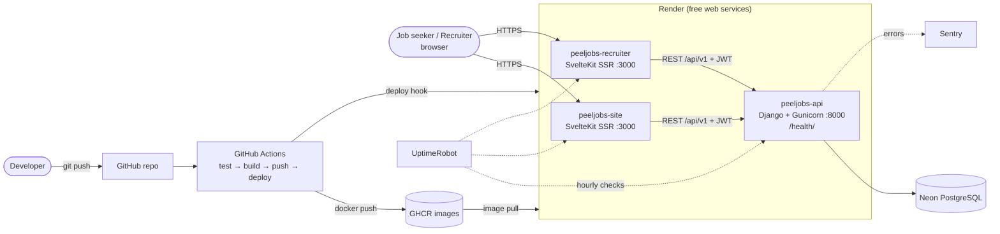

# PeelJobs — DevOps Implementation Guide

Step-by-step implementation of every part of the mini-project report guidelines, using **free services only (no credit card)**. Section numbers match the report template.

> The application is the open-source [PeelJobs job portal](https://github.com/MicroPyramid/opensource-job-portal) by MicroPyramid (MIT licence). Credit it in the report's Introduction and References — the DevOps work (containers, pipeline, deployment, monitoring) is ours.

---

## 0. Free stack (what replaces what)

| Report category | Template suggests | We use (free, no card) |
|---|---|---|
| Programming | Python / Node.js | Python 3.12 (Django 5.2) + Node 22 (SvelteKit) |
| Source control | Git / GitHub | Git + GitHub |
| Containerization | Docker | Docker + Docker Compose |
| CI/CD | GitHub Actions / Cloud Build | **GitHub Actions** |
| Registry | Google Artifact Registry | **GitHub Container Registry (GHCR)** |
| Deployment | Google Cloud Run | **Render** (free web services, run our images) |
| Database | (Cloud SQL) | **Neon** (free serverless Postgres) |
| Monitoring / Logging | Google Cloud Monitoring / Logging | **Render Logs & Metrics + UptimeRobot + Sentry** |

Accounts to create (all free tiers, sign in with GitHub where offered): GitHub, Render, Neon, UptimeRobot, Sentry.

**Free-tier limits to state in the report:**
- Render free services **sleep after 15 min idle**; the next request takes ~30–60 s (cold start).
- Render gives **750 free instance-hours/month per workspace**, shared by all 3 services. Keeping all three awake 24/7 would need 2,160 h, so monitors ping hourly (§9), not every 5 min.
- Container disk is wiped on every deploy, so uploaded resumes/logos don't persist.
- Celery runs tasks inline (no Redis worker); scheduled (beat) jobs don't run.
- Emails are printed to the backend logs instead of being sent (switch to Brevo's free SMTP to send real mail — see `backend/jobsp/settings_cloud.py`).

---

## 6. Technologies and Tools Used (table for the report)

| Category | Technology |
|---|---|
| Programming | Python 3.12, Django 5.2, Django REST Framework; TypeScript, SvelteKit 2 (Node 22) |
| Source Control | Git, GitHub |
| Build & Test | uv, ruff, Django test runner (177+ tests), pnpm, svelte-check, Vite |
| Containerization | Docker (3 images), Docker Compose |
| CI/CD | GitHub Actions |
| Registry | GitHub Container Registry (ghcr.io) |
| Deployment | Render (3 web services) + Neon PostgreSQL |
| Monitoring | Render Logs/Metrics, UptimeRobot (uptime + alerts + status page), Sentry (errors) |

---

## 7. Application Architecture

GitHub renders this diagram; for the report, screenshot it or redraw it in draw.io.



How a request flows: the browser only talks to the SvelteKit app it's on. That app's server keeps the login token in an HttpOnly cookie and calls the Django REST API, which reads and writes Postgres.

---

## 8. DevOps Implementation

### 8.1 Develop — application development

The app has three parts:

| Folder | What it is | Local port |
|---|---|---|
| `backend/` | Django REST API + admin | 8000 |
| `site/` | Job-seeker website (SvelteKit) | 5173 |
| `recruiter/` | Recruiter portal (SvelteKit) | 5174 |

Run it locally (already set up on this machine, using the `devenv` conda env for Python and Node):

```powershell
powershell -ExecutionPolicy Bypass -File "D:\Job Portal\start-dev.ps1"
```

DevOps-related code added to the project:

| File | Purpose |
|---|---|
| `backend/jobsp/urls.py` → `/health/` | Health endpoint: returns `{"status":"ok","db":"up","version":"<git sha>"}` or HTTP 503 if the DB is unreachable |
| `backend/jobsp/tests.py` | Tests for the health endpoint (up and down cases) |
| `backend/jobsp/settings_cloud.py` | Production settings read entirely from environment variables (12-factor) |
| `backend/Dockerfile`, `frontend.Dockerfile` | Container images |
| `docker-compose.yml` | Runs the whole stack locally in containers |
| `.github/workflows/ci-cd.yml` | CI/CD pipeline |

📸 **Evidence:** the app running locally (home page, jobs list, recruiter login), plus `http://localhost:8000/health/`.

### 8.2 Git / GitHub — repository and commits

1. Create an **empty public** repository on GitHub, e.g. `peeljobs-devops`. Don't add a README or .gitignore; the project already has them. Public keeps Actions minutes and GHCR free and unlimited.
2. In PowerShell:
   ```powershell
   cd "D:\Job Portal"
   git init -b main
   git add .
   git status        # check: no .env files, no node_modules
   git commit -m "Import PeelJobs codebase with Docker, CI/CD and cloud settings"
   git remote add origin https://github.com/<your-user>/peeljobs-devops.git
   git push -u origin main
   ```
3. Team workflow: every team member works on a branch and opens a Pull Request; CI runs on the PR, and you merge after it's green.
   ```powershell
   git checkout -b feature/<name>
   # edit, then:
   git add -A; git commit -m "Describe the change"
   git push -u origin feature/<name>
   ```
4. Protect `main`: **Settings → Branches → Add rule** → `main` → tick *Require a pull request before merging* and *Require status checks to pass* (select the CI jobs once they've run once).

📸 **Evidence:** repo home page, commit history (`Insights → Network` or the commits list), a merged PR with green checks.

### 8.3 Build and Testing

What runs (locally and in CI):

| Part | Build / test commands |
|---|---|
| Backend | `ruff check .` (lint), `ruff format --check .` (style), `manage.py check`, `makemigrations --check` (no missing migrations), `manage.py test` (177+ unit/API tests) |
| Site / Recruiter | `pnpm check` (TypeScript + Svelte type-check), `pnpm build` (production build) |

Run the backend tests locally once. The local `peeljobs` DB user needs permission to create the throwaway test database; grant it once as the `postgres` superuser:

```powershell
psql -U postgres -h 127.0.0.1 -c "ALTER ROLE peeljobs CREATEDB;"
```

Then:

```powershell
$env:Path = "D:\Conda\envs\devenv;D:\Conda\envs\devenv\Scripts;" + $env:Path
cd "D:\Job Portal\backend"
uvx ruff check .
python manage.py test --noinput
cd ..\site;      pnpm check; pnpm build
cd ..\recruiter; pnpm check; pnpm build
```

📸 **Evidence:** terminal showing `Ran N tests ... OK`, ruff `All checks passed!`, svelte-check `0 errors`, and a successful `vite build`.

### 8.4 Docker — containerization

Three images:

- **`backend/Dockerfile`**: `python:3.12-slim`; installs the locked dependencies with `uv`; collects static files at build time; runs as a non-root user; has a `HEALTHCHECK` on `/health/`; the start command runs migrations, then Gunicorn.
- **`frontend.Dockerfile`**: shared by `site/` and `recruiter/`. Multi-stage: the first stage builds with pnpm, the second is a slim Node runtime with production dependencies only, running as the `node` user. The public URLs are passed as build arguments because SvelteKit bakes them in at build time.

Run the whole stack in containers (Docker Desktop must be running):

```powershell
cd "D:\Job Portal"
docker compose up --build -d
docker compose ps          # all services "healthy"/"running"
curl http://localhost:8000/health/
docker compose logs -f backend
docker compose down        # stop (add -v to also delete the DB volume)
```

Then open http://localhost:5173 and http://localhost:5174.

Build a single image by hand:

```powershell
docker build -t peeljobs-backend ./backend
docker build -f frontend.Dockerfile -t peeljobs-site ./site
docker images | findstr peeljobs
```

📸 **Evidence:** `docker compose ps`, `docker images`, the site running from containers, Docker Desktop's container list.

### 8.5 Package / Register — push images to the registry (GHCR)

CI pushes the images automatically on every push to `main` (8.6), tagged with **the commit SHA** and `latest`:

```
ghcr.io/<your-user>/peeljobs-backend:<sha> / :latest
ghcr.io/<your-user>/peeljobs-site:<sha>    / :latest
ghcr.io/<your-user>/peeljobs-recruiter:<sha> / :latest
```

**One-time step after the first pipeline run:** make each package public so Render can pull it without credentials. Go to GitHub → your profile → **Packages** → `peeljobs-backend` → **Package settings** → *Change visibility* → **Public**. Repeat for `site` and `recruiter`.

To push manually (useful as report evidence), create a classic Personal Access Token with only the `write:packages` scope at GitHub → Settings → Developer settings, then:

```powershell
docker login ghcr.io -u <your-user>     # paste the token when prompted for a password
docker tag peeljobs-backend ghcr.io/<your-user>/peeljobs-backend:manual
docker push ghcr.io/<your-user>/peeljobs-backend:manual
```

📸 **Evidence:** the Packages page showing the 3 images and their SHA tags.

### 8.6 Continuous Integration — pipeline and execution

`.github/workflows/ci-cd.yml` runs on every push and every Pull Request:

```
push / PR
  ├─ backend   : Postgres service container → uv sync → ruff → check → makemigrations --check → tests
  ├─ frontend  : (matrix: site, recruiter) pnpm install → svelte-check → vite build
  │
  └─ (main only, if both pass)
     images    : (matrix: backend, site, recruiter) docker build → push to GHCR (:sha, :latest)
     deploy    : Render deploy hooks → wait until /health/ reports this commit → check frontends return 200
```

Key properties to explain in the report:
- **Quality gate:** images are only built, and code only deployed, when every test and check passes. A failing PR can't reach production.
- **Reproducible builds:** `uv.lock` and `pnpm-lock.yaml` are installed with `--locked` / `--frozen-lockfile`.
- **Speed:** dependency caches (uv, pnpm) and Docker layer cache (`type=gha`).
- **Traceability:** every image is tagged with the commit SHA, and the running backend reports it at `/health/`.

To see it: GitHub repo → **Actions** tab → open a run → click into a job to view its logs.

📸 **Evidence:** the Actions run graph (all jobs green), one job's log showing tests passing, a PR's "All checks have passed".

### 8.7 Deployment — Neon + Render

The order matters, because the Render services need the images to already exist in GHCR.

**Step 1: push to `main` once (8.2).** CI builds and pushes the images. The `deploy` job is skipped because `API_URL` isn't set yet. Then make the 3 packages public (8.5).

**Step 2: create the database on Neon.**
1. https://neon.tech → sign up with GitHub → **Create project**: name `peeljobs`, Postgres 17, region **AWS Asia Pacific (Singapore)** (or the region nearest you).
2. **Dashboard → Connect**: note the **host** (`ep-…​.aws.neon.tech`), **database** (`neondb`), **user** (`neondb_owner`) and **password**. Use the direct (non-pooled) host.

**Step 3: create 3 Render web services.** https://render.com → sign up with GitHub → **New → Web Service → Existing Image**. Pick the same region as Neon.

| Service name | Image URL | Instance type |
|---|---|---|
| `peeljobs-api` | `ghcr.io/<your-user>/peeljobs-backend:latest` | Free |
| `peeljobs-site` | `ghcr.io/<your-user>/peeljobs-site:latest` | Free |
| `peeljobs-recruiter` | `ghcr.io/<your-user>/peeljobs-recruiter:latest` | Free |

Render names each URL `https://<service-name>.onrender.com`, adding a suffix if the name is taken. Use the real URLs from the dashboard in the values below.

Environment variables for **peeljobs-api**:

| Key | Value |
|---|---|
| `SECRET_KEY` | click **Generate** |
| `ALLOWED_HOSTS` | `peeljobs-api.onrender.com,localhost` |
| `CSRF_TRUSTED_ORIGINS` | `https://peeljobs-api.onrender.com` |
| `DB_HOST` / `DB_NAME` / `DB_USER` / `DB_PASSWORD` | from Neon |
| `DB_PORT` | `5432` |
| `DB_SSLMODE` | `require` |
| `PEEL_URL` | `https://peeljobs-api.onrender.com/` |
| `SITE_FRONTEND_URL` | `https://peeljobs-site.onrender.com` |
| `RECRUITER_FRONTEND_URL` | `https://peeljobs-recruiter.onrender.com` |
| `SENTRY_DSN` | from §9 (add later) |

Under **Advanced → Health Check Path**, set `/health/`. Render then only switches traffic to a new deploy once it reports healthy.

Environment variables for **peeljobs-site**: `ORIGIN` = `https://peeljobs-site.onrender.com`
Environment variables for **peeljobs-recruiter**: `ORIGIN` = `https://peeljobs-recruiter.onrender.com`

The first backend start runs all migrations against Neon, which takes a minute or two. Watch the **Logs** tab.

**Step 4: wire up CD.** For each service, go to **Settings → Deploy Hook** and copy the URL. Then in GitHub → repo **Settings → Secrets and variables → Actions**:

| Type | Name | Value |
|---|---|---|
| Secret | `RENDER_HOOK_BACKEND` | backend's deploy hook URL |
| Secret | `RENDER_HOOK_SITE` | site's deploy hook URL |
| Secret | `RENDER_HOOK_RECRUITER` | recruiter's deploy hook URL |
| Variable | `API_URL` | `https://peeljobs-api.onrender.com` (no trailing slash) |
| Variable | `SITE_URL` | `https://peeljobs-site.onrender.com` |
| Variable | `RECRUITER_URL` | `https://peeljobs-recruiter.onrender.com` |

Then **Actions → CI/CD → Run workflow** on `main`. This rebuilds the frontends with the real URLs baked in and deploys all three.

**Step 5: create an admin user in the cloud DB** (from your PC, pointed at Neon; the Render free tier has no shell):

```powershell
$env:Path = "D:\Conda\envs\devenv;D:\Conda\envs\devenv\Scripts;" + $env:Path
cd "D:\Job Portal\backend"
$env:DJANGO_SETTINGS_MODULE = "jobsp.settings_cloud"
$env:DB_HOST = "<neon host>"; $env:DB_NAME = "neondb"; $env:DB_USER = "neondb_owner"
$env:DB_PASSWORD = "<neon password>"; $env:DB_SSLMODE = "require"
python manage.py createsuperuser
```

Close that PowerShell window afterwards so the Neon credentials don't linger in the session. Then log in at `https://peeljobs-api.onrender.com/admin/`.

📸 **Evidence:** the Render dashboard with 3 services "Live", a service's Events tab showing deploys, the live site, `https://peeljobs-api.onrender.com/health/`, and the Neon dashboard.

### 8.8 Continuous Delivery — automatic deployment

From now on, **every merge or push to `main` deploys itself**:

1. CI passes, so the images are pushed as `:<commit-sha>`.
2. The `deploy` job calls each Render deploy hook with `imgURL=ghcr.io/…:<commit-sha>`, so Render deploys exactly the image CI tested.
3. Render pulls the image, starts it, waits for `/health/` to pass, then switches traffic to it. A deploy that fails its health check never receives traffic; the previous version keeps serving.
4. The pipeline polls `API_URL/health/` until `"version"` equals the commit SHA, then checks both frontends return 200. If that doesn't happen within ~15 minutes, the run goes **red**.

To demonstrate it: change some visible text (e.g. a heading in `site/src/routes/(site)/+page.svelte`), commit, push, and watch the Actions run. Then reload the live site and `/health/` (the version changes).

**Rollback:** Render → service → **Events** → pick the previous successful deploy → **Rollback**. Or re-run the `deploy` job of an older green workflow run, which deploys that commit's image.

📸 **Evidence:** the `deploy` job log showing `/health/` reaching the new SHA, before/after screenshots of the change, and Render's Events list.

---

## 9. Monitoring and SRE Practices

### 9.1 Logging and metrics: Render

- **Logs tab** (per service): Gunicorn access logs (`--access-logfile -`), Django logs (INFO and above, see `LOGGING` in `settings_cloud.py`), migration output and startup errors. Searchable, with live tail.
- **Metrics tab**: CPU, memory and HTTP request graphs.
- **Events tab**: every deploy, its outcome, and health-check failures.

### 9.2 Uptime and alerting: UptimeRobot

https://uptimerobot.com → free account → **Add New Monitor**:

| Monitor | Type | URL | Setting |
|---|---|---|---|
| PeelJobs API | **Keyword** | `https://peeljobs-api.onrender.com/health/` | keyword `"status": "ok"` must **exist** |
| PeelJobs Site | HTTP(s) | `https://peeljobs-site.onrender.com/` | — |
| PeelJobs Recruiter | HTTP(s) | `https://peeljobs-recruiter.onrender.com/` | — |

- **Interval: 60 minutes** normally, to stay within Render's 750 free hours. During demos or the failure exercise, change it to 5 minutes and switch it back afterwards.
- **Alert contact:** your email (add teammates too).
- **Status page:** Status Pages → New → add the 3 monitors. This gives a public page showing uptime % (good report evidence).

The keyword monitor matters: if the DB goes down, the backend still answers, but with HTTP 503 and `"status": "error"`, and the monitor catches it.

### 9.3 Error tracking: Sentry

1. https://sentry.io → free Developer plan → **Create project** → platform **Django** → copy the **DSN**.
2. Render → `peeljobs-api` → Environment → add `SENTRY_DSN` = the DSN → Save. Saving redeploys the service.
3. `settings_cloud.py` already initialises Sentry, tagging each event with `release` = the commit SHA, so errors are linked to the exact deploy that introduced them.
4. **Alerts:** Sentry → Alerts → create an "issue alert" that emails you when a new issue appears.

### 9.4 Two SRE practices implemented

**Practice 1: SLIs, an SLO and alerting.**
- **SLI (availability):** the percentage of `/health/` checks that return 200 with `"status": "ok"`. It's measured by UptimeRobot.
- **SLO:** 99.0% monthly availability for the API. That gives an **error budget** of 1% ≈ 7.2 hours a month.
- **Alerting:** UptimeRobot emails the team when a check fails, and again when the service recovers. Sentry emails on new errors.
- **Discussion point:** free-tier cold starts (~30–60 s) can make a check slow or fail. They use up the error budget even though nothing is broken. This is the kind of reliability-versus-cost trade-off an error budget makes visible. The fix is a paid instance that doesn't sleep.

**Practice 2: health-checked, verified deployments with fast rollback.**
- The `/health/` endpoint checks the app *and* its database dependency, and reports the running version.
- Render won't route traffic to a new deploy until `/health/` passes, so a broken release doesn't replace a working one.
- The pipeline verifies each deployment: it fails unless production reports the new commit SHA as healthy.
- Rollback to the previous deploy is one click (8.8).
- Only commits that passed every automated test are deployed (CI gate), so the release process is the same every time.

(Optionally, a third: the **blameless postmortem** written for §10.)

### 9.5 How health and reliability were observed

Show: the UptimeRobot dashboard and status page (uptime %, response-time graph), the Render Metrics graphs, the Render Logs during normal traffic, and Sentry's Issues list (empty when healthy, with the §10 incident otherwise).

---

## 10. Failure and Recovery (one documented incident)

**Scenario: the database password is rotated, but the app's configuration isn't updated.** This happens a lot in real systems.

Before you start, set the UptimeRobot API monitor interval to **5 minutes** and make sure the site is healthy. Take a screenshot of the time.

| Stage | What to do | Evidence to capture |
|---|---|---|
| **Failure** | Neon → project → **Roles** → `neondb_owner` → **Reset password**. Copy the new password, but don't update Render yet. Then open a few pages on the live site, e.g. the jobs list. | Neon's reset confirmation; the site showing an error |
| **Detection** | Within ~5 minutes UptimeRobot marks **PeelJobs API = Down** (keyword missing, HTTP 503) and emails you. Sentry emails a new issue: `OperationalError: password authentication failed`. | The alert email, UptimeRobot showing red, the Sentry issue |
| **Diagnosis** | Visit `https://peeljobs-api.onrender.com/health/`: it shows `{"status": "error", "db": "down"}`, so the app process is fine and the DB connection isn't. Render → Logs shows `password authentication failed for user "neondb_owner"`. The Sentry issue's stack trace points to the DB connection. Conclusion: stale DB credentials. | `/health/` output, the Render log line, the Sentry stack trace |
| **Fix** | Render → `peeljobs-api` → **Environment** → set `DB_PASSWORD` to the new password → **Save, rebuild and deploy**. | The env var edit screen (hide the value) |
| **Redeployment** | Render redeploys. Its Events tab shows the deploy going live after `/health/` passes. | Render's Events / deploy log |
| **Recovery** | `/health/` returns `"status": "ok"`. UptimeRobot marks the API **Up** and sends a recovery email; the downtime duration is shown. Resolve the Sentry issue. | The recovery email, the UptimeRobot incident with its duration, `/health/` OK |

Then write a short **blameless postmortem** for the report: timeline (with timestamps from the alerts), impact (downtime minutes, against the 7.2 h error budget), root cause, and action items. For example: "store DB credentials in a secret manager and rotate them in both places together"; "add a pre-rotation checklist".

**Optional second demonstration: a failure stopped by CI.** On a branch, break the health endpoint (e.g. make it return status 500) and open a PR. `backend` tests fail (`jobsp/tests.py`), the PR shows a red ❌, and the `images` and `deploy` jobs don't run, so production is never affected. Revert the change and the checks go green. This shows CI as the first line of defence.

---

## 11. Results checklist

- [ ] App runs locally (8.1) and in Docker Compose (8.4)
- [ ] Repo on GitHub with a commit history, PRs and branch protection (8.2)
- [ ] CI run green: lint, 177+ tests, type checks, builds (8.3, 8.6)
- [ ] 3 images in GHCR tagged with the commit SHA (8.5)
- [ ] 3 Render services live, backend on Neon (8.7)
- [ ] A push to `main` deployed itself, verified by `/health/` version (8.8)
- [ ] UptimeRobot monitors and status page, Sentry connected (9)
- [ ] Failure detected and recovered, with alert and recovery emails (10)

## 13. References

- Docker docs: https://docs.docker.com/ (Dockerfile reference, multi-stage builds, Compose)
- GitHub Actions: https://docs.github.com/actions
- GitHub Container Registry: https://docs.github.com/packages/working-with-a-github-packages-registry/working-with-the-container-registry
- Render — deploy a prebuilt image: https://render.com/docs/deploying-an-image · deploy hooks: https://render.com/docs/deploy-hooks · health checks: https://render.com/docs/health-checks · free tier: https://render.com/docs/free
- Neon docs: https://neon.tech/docs
- UptimeRobot: https://uptimerobot.com/help/
- Sentry for Django: https://docs.sentry.io/platforms/python/integrations/django/
- Django deployment checklist: https://docs.djangoproject.com/en/5.2/howto/deployment/checklist/
- SvelteKit adapter-node: https://svelte.dev/docs/kit/adapter-node
- uv (Python packaging): https://docs.astral.sh/uv/
- Google SRE book, ch. 4 "Service Level Objectives": https://sre.google/sre-book/service-level-objectives/
- PeelJobs upstream repository: https://github.com/MicroPyramid/opensource-job-portal
